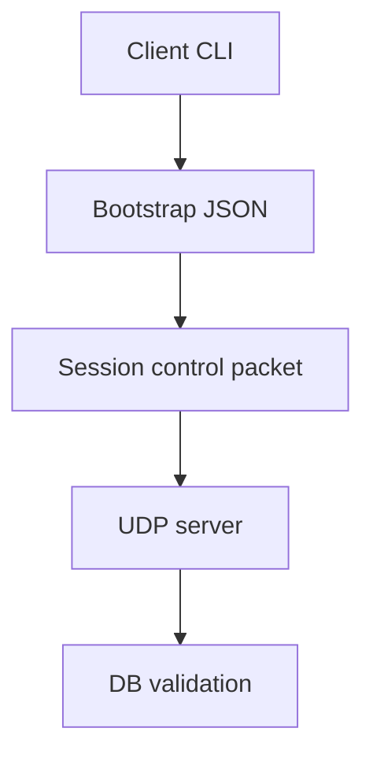

# Step190 - client content manifest in bootstrap payload

Ten krok przesuwa roadmapę autorytatywnego serwera o jeden praktyczny element:
klient nie tylko może dostać hash content packa z linii komend, ale przekazuje go
przez realny bootstrap MMO do serwera. Serwer zapisuje tę deklarację w aktywnej
konfiguracji sesji i odpala istniejącą walidację manifestu przy każdym
bootstrapie postaci.

To nadal nie oznacza, że klient jest źródłem prawdy. Klient wysyła tylko
deklarację wersji contentu. Źródłem prawdy pozostaje serwer, jego baza danych i
jego własna kopia content packa.

## Co zmienia ten krok

Dodany został przepływ:



W praktyce:

- klient przyjmuje `-mmo-client-content-manifest-hash` oraz alias
  `-mmo-content-manifest-hash`;
- wartość trafia do `CommandLine`;
- bootstrap z gry dopisuje `client_content_manifest_hash`;
- semantyczny pakiet sesji ma nowe pole `clientContentManifestHash`;
- encoder dopisuje pole na końcu pakietu, a decoder czyta je jako pole opcjonalne;
- serwer mapuje pole do JSON payloadu;
- bootstrap handler serwera aktualizuje `activeOpt.clientContentManifestHash`;
- serwer wywołuje `validateClientContentManifestForSession(..., "bootstrap")`.

## Dlaczego to jest potrzebne

Wcześniej serwerowy gate contentu działał głównie przez flagę procesu serwera:

- `--client-content-manifest-hash`;
- `--require-client-content-manifest`.

To wystarczało do testu lokalnego, ale nie wystarcza dla prawdziwego klienta MMO,
bo w świecie wielu graczy każdy klient musi zadeklarować swoją wersję contentu na
wejściu do sesji. Serwer nie powinien zgadywać wersji klienta z własnego procesu
ani ufać plikom z komputera gracza.

Po tym kroku deklaracja zaczyna iść z klienta przez tę samą ścieżkę, którą
później przejdą także inne dane bootstrapu: wybrana postać, świat, endpoint,
wersja protokołu i docelowo pełna informacja o pakiecie contentu.

## Granica zaufania

Klient może powiedzieć:

```json
{
  "client_content_manifest_hash": "sha256:..."
}
```

Ale klient nie może decydować:

- jaki ZEN jest autorytatywny;
- jakie NPC istnieją;
- jakie dialogi są dostępne;
- jakie rutyny działają;
- czy quest został wykonany;
- czy NPC ma zaczepić gracza;
- czy gracz może wejść w dialog;
- czy świat po stronie klienta jest zgodny z serwerem.

Serwer porównuje deklarację klienta z własnym manifestem contentu zapisanym w DB.
Jeżeli gate jest w trybie wymaganym, brak hasha albo mismatch ma blokować
bootstrap.

## Pola i kontrakty

| Warstwa | Pole / flaga | Znaczenie |
| --- | --- | --- |
| CLI klienta | `-mmo-client-content-manifest-hash` | Jawna deklaracja wersji content packa klienta |
| CLI klienta | `-mmo-content-manifest-hash` | Krótszy alias developerski |
| Bootstrap JSON | `client_content_manifest_hash` | Pole wysyłane w payloadzie bootstrapu |
| Net protocol | `ClientSessionControlPacket::clientContentManifestHash` | Binarny transport pola do serwera |
| Serwer | `activeOpt.clientContentManifestHash` | Aktywna deklaracja contentu dla aktualnej sesji |
| DB | `mmo_validate_client_content_pack_for_session` | Procedura walidująca deklarację klienta |

## Kompatybilność pakietu binarnego

Pole `clientContentManifestHash` zostało dopisane jako końcowe pole
`ClientSessionControlPacket`.

Decoder czyta je opcjonalnie:

- stare pakiety bez tego pola nadal mogą zostać zdekodowane;
- nowe pakiety przekazują hash, jeżeli klient go podał;
- nie trzeba jeszcze podbijać globalnej wersji pakietu wyłącznie dla tego
  miękkiego pola bootstrapu.

Docelowo, gdy content gate stanie się wymaganym kontraktem produkcyjnym, warto
rozważyć twardszy handshake wersji protokołu:

- `protocol_version`;
- `content_manifest_schema_version`;
- `content_pack_id`;
- `content_pack_hash`;
- `server_required_content_hash`;
- powód odrzucenia bootstrapu czytelny dla UI.

## Co jeszcze jest protezą

Ten krok nadal używa hasha podanego ręcznie z CLI. To jest dobre jako etap
przejściowy, bo pozwala testować serwerowy gate bez budowania pełnego skanera
zasobów klienta.

Docelowo klient powinien umieć sam wyliczyć albo odczytać lokalny manifest:

- z pliku manifestu wygenerowanego przez narzędzia content pipeline;
- z cache OpenGothic po wykryciu gry/moda;
- z listy plików VDF/MOD/DAT/ZEN/OU;
- z podpisanego pliku serwera dystrybucji moda.

Ważne: nawet automatyczne liczenie po stronie klienta nadal nie daje klientowi
autorytetu. To tylko wygodniejszy sposób powiedzenia serwerowi, jaką wersję
contentu klient twierdzi, że posiada.

## Jak to łączy się z NPC zaczepiającym gracza

NPC zaczepiający gracza wymaga, żeby serwer znał dokładnie ten sam świat i te
same reguły contentu, które klient renderuje:

- pozycje NPC z ZEN albo z DB;
- waypointy i freepointy;
- guildy, frakcje i nastawienie;
- percepcje typu `PERC_ASSESSPLAYER`;
- funkcje skryptowe przypisane do percepcji;
- warunki dialogów;
- outputy dialogowe;
- rutyny dzienne;
- aktualny stan świata MMO.

Jeżeli klient ma inny content niż serwer, to klient może widzieć NPC w innym
miejscu, inny dialog, inną ścieżkę albo inny stan warunku. Dlatego content gate
jest fundamentem pod późniejsze:

- serwerowe AI ticki NPC;
- serwerowe eventy percepcji;
- autorytatywny start dialogu;
- walidację dystansu i widoczności;
- synchronizację animacji i dialog UI u wielu graczy.

## Docelowa architektura contentu na serwerze

Serwer powinien mieć własny katalog content packa, a nie czytać pliki z klienta.

Minimalny docelowy content pack:

| Typ pliku | Rola serwera |
| --- | --- |
| ZEN | geometria świata, VOB-y, spawn pointy, waypointy, freepointy |
| DAT / skrypty | definicje NPC, itemów, guild, funkcji percepcji, warunków dialogów |
| OU / output units | identyfikatory linii dialogowych, napisy, powiązanie z audio |
| VDF / MOD metadata | lista archiwów, wersja moda, hash contentu |
| manifest JSON | jawny indeks zasobów, hash, schema version, content pack id |
| DB seed | projekcja contentu gotowa do szybkich zapytań serwera |

W pierwszych etapach serwer nie musi wykonywać pełnego Daedalusa. Może czytać
projekcję przygotowaną offline:

- `npc_templates`;
- `npc_spawn_points`;
- `world_waypoints`;
- `dialog_infos`;
- `dialog_outputs`;
- `perception_rules`;
- `routine_blocks`;
- `guild_relations`;
- `content_manifest_entries`.

Później można dołożyć interpreter albo częściową maszynę reguł dla tych funkcji,
które naprawdę wpływają na MMO.

## Wielu graczy, jeden świat

Najważniejsza zmiana mentalna: serwer nie może działać jak lokalny Gothic dla
jednego hero. Musi mieć model świata wspólny dla wielu sesji.

Przykład:

| Problem | Single player | MMO server |
| --- | --- | --- |
| Kto odpala AI NPC | lokalny klient | serwer |
| Kto widzi gracza | lokalny NPC widzi PC_HERO | NPC widzi wielu graczy w interest area |
| Kto wybiera dialog | lokalny skrypt | serwerowa reguła + DB |
| Kto zapisuje cooldown | save gry | DB MMO |
| Kto emituje animację | klient | serwer wysyła delta event |
| Kto jest prawdą | proces klienta | serwer |

Dla NPC zaczepiającego gracza serwer musi robić tick w stylu:

1. Zbierz graczy w zasięgu NPC.
2. Odrzuć graczy poza światem, instancją albo interest area.
3. Sprawdź LOS / dystans / FOV / stan NPC.
4. Sprawdź cooldown percepcji dla pary `npc_id + player_id`.
5. Sprawdź priorytety: walka, dialog, rutyna, scripted scene.
6. Oceń regułę percepcji.
7. Zarezerwuj interakcję w DB albo w world-state locku.
8. Wyślij event do zainteresowanych klientów.
9. Zapisz efekt: cooldown, dialog started, AI state, quest flag, memory flag.

Ten krok z content hashem jest mały technicznie, ale potrzebny przed tym
mechanizmem: serwer musi wiedzieć, że klient, któremu każe pokazać dialog, ma
zgodny content.

## Roadmapa od obecnego kroku do serwera jako 100% source of truth

### Faza 1 - gate wersji contentu

Status po tym kroku:

- serwer ma manifest content packa w DB;
- klient może wysłać `client_content_manifest_hash`;
- bootstrap serwera odpala walidację manifestu;
- tryb `--require-client-content-manifest` może wymusić zgodność.

Następne prace:

- odpowiedź serwera z czytelnym powodem odrzucenia bootstrapu;
- UI klienta dla mismatchu contentu;
- automatyczne wyliczanie lokalnego hasha klienta;
- podpisany manifest content packa;
- test regresyjny: brak hasha, zgodny hash, niezgodny hash.

### Faza 2 - import contentu serwera

Serwer powinien dostać narzędzie importujące:

- ZEN do tabel świata;
- waypointy i freepointy;
- NPC templates;
- spawn NPC;
- dialog info i outputy;
- podstawowe guild relations;
- podstawowe perception definitions;
- rutyny dzienne.

W tej fazie nadal można ignorować pełne wykonywanie Daedalusa. Chodzi o to,
żeby serwer miał twardą mapę contentu i mógł odpowiadać na pytania:

- gdzie NPC może stać;
- gdzie może iść;
- jaki dialog istnieje;
- jaki output ID ma zostać wysłany klientowi;
- które NPC należą do której gildii;
- jakie eventy percepcji są w ogóle możliwe.

### Faza 3 - projekcja DB pod MMO

Obecna baza ma już dużo przyrostowych elementów, ale docelowo i tak powinna
zostać przepisana pod pełny model autorytatywnego serwera.

Planowany rewrite bazy powinien rozdzielić:

- content static tables;
- live world state;
- session state;
- character state;
- NPC runtime state;
- event log;
- outbox do broadcastu;
- snapshoty bootstrapowe;
- migracje content packów;
- wersjonowanie protokołu i manifestu.

Przykładowy kierunek:

| Obszar | Docelowa rola |
| --- | --- |
| `content_*` | immutable albo versioned dane z ZEN/DAT/OU |
| `world_*` | aktywny stan świata dla instancji |
| `character_*` | stan gracza, inventory, questy, pozycja |
| `npc_*` | runtime NPC, AI state, cooldowny, dialog locks |
| `interaction_*` | dialogi, zaczepki, percepcje, walki |
| `net_*` | sesje, protokół, content gate, bootstrap |
| `event_*` | append-only log decyzji serwera |

Rewrite bazy nie powinien być tylko porządkiem tabel. To powinno być przejście z
modelu "capture z klienta" na model "server simulation first".

### Faza 4 - serwerowe NPC runtime

W tej fazie NPC stają się bytami serwerowymi:

- mają globalne `npc_runtime_id`;
- mają `template_id`;
- mają świat i instancję;
- mają pozycję, yaw, stan animacji;
- mają aktualną rutynę;
- mają target albo brak targetu;
- mają cooldowny percepcji;
- mają lock dialogu;
- mają status życia, walki i despawnu.

Klient dostaje tylko snapshot i delty:

- NPC spawned;
- NPC moved;
- NPC turned;
- NPC started talking;
- NPC line output;
- NPC entered combat;
- NPC state changed.

### Faza 5 - percepcje i zaczepianie gracza

Minimalny event:

```json
{
  "event": "npc_interaction_started",
  "interaction": "greet_player",
  "npc_id": "XARDAS",
  "player_id": "player:123",
  "dialog_id": "DIA_XARDAS_HELLO",
  "reason": "PERC_ASSESSPLAYER",
  "server_time_ms": 123456
}
```

Serwer decyduje, czy event powstaje. Klient:

- obraca kamerę, jeśli UI tego wymaga;
- pokazuje dialog;
- odtwarza output;
- synchronizuje animacje;
- wysyła wyłącznie wybory gracza jako propozycje.

Klient nie powinien sam startować dialogu jako prawdy. Może wysłać:

```json
{
  "action": "player_dialog_choice_proposal",
  "dialog_id": "DIA_XARDAS_HELLO",
  "choice_id": "INFO_01"
}
```

Serwer waliduje:

- czy dialog nadal trwa;
- czy gracz jest stroną dialogu;
- czy wybór istnieje;
- czy warunki są spełnione;
- czy NPC nie zmienił stanu;
- czy content hash klienta nadal pasuje do sesji.

### Faza 6 - częściowy Daedalus albo reguły kompilowane

Pełne odpalenie Daedalusa na serwerze to duży temat. Rozsądniejszy kierunek:

1. Najpierw eksportować najważniejsze fakty do DB.
2. Potem zrobić własne serwerowe reguły dla percepcji i dialogów.
3. Dopiero potem rozważyć interpreter subsetu Daedalusa.

Funkcje priorytetowe:

- warunki dialogów;
- `Npc_KnowsInfo`;
- guild attitude;
- perception handlers;
- quest flags;
- mission variables;
- item checks;
- distance checks;
- time of day checks;
- routine decisions.

Funkcje niskiego priorytetu:

- czysto lokalne efekty kamery;
- efekty UI;
- odtwarzanie audio;
- drobne skryptowe ozdobniki bez wpływu na stan serwera.

### Faza 7 - twardy handshake contentu i protokołu

Docelowy handshake powinien wyglądać mniej więcej tak:

1. Klient wysyła wersję protokołu i hash content packa.
2. Serwer sprawdza, czy content pack jest dozwolony.
3. Serwer odsyła wymagany content pack id/hash.
4. Serwer tworzy albo wznawia sesję.
5. Serwer wysyła bootstrap snapshot.
6. Klient materializuje snapshot.
7. Serwer zaczyna wysyłać live delty.

Jeżeli mismatch:

- klient nie dostaje świata MMO;
- UI pokazuje wymagany content pack;
- sesja może zostać zapisana jako odrzucona;
- serwer nie wykonuje AI/dialogów dla tej sesji.

## Nowe ryzyka po tym kroku

| Ryzyko | Znaczenie | Mitigacja |
| --- | --- | --- |
| Hash nadal jest ręczny | Test może przejść z przypadkową wartością | Dodać automatyczne liczenie lub manifest file |
| Brak UI mismatchu | Gracz może widzieć tylko techniczny fail bootstrapu | Dodać diagnostic payload do klienta |
| Walidacja na bootstrapie jest per active session | W przyszłości wielu klientów wymaga osobnego stanu sesji | Rozdzielić runtime sessions per remote/client id |
| DB schema urośnie chaotycznie | Kolejne kroki będą doklejały tabele | Zaplanować rewrite DB pod `content_*`, `world_*`, `npc_*` |
| Brak pełnego content importera | Serwer zna hash, ale nie zna jeszcze całego świata | Następny duży krok: importer ZEN/DAT/OU do projekcji DB |

## Następny sensowny krok

Step191 dopina pierwszy fragment tej listy: serwerowy diagnostic potrafi teraz
odróżnić contentowy reject bootstrapu od zwykłego `bootstrap_failed`.
Step192 dopina kolejny fragment: diagnostic może nieść wymagany hash serwera i
aktywny `content_revision_key`.

Najbardziej opłacalny kolejny krok to nadal nie pełny Daedalus, tylko:

- przepuścić contentowy diagnostic do UI klienta;
- zapisać w DB powód odrzucenia bootstrapu jako audyt sesji;
- przygotować szkielet tabel `content_worlds`, `content_npc_templates`,
  `content_waypoints`, `content_dialog_infos`;
- zacząć importer od manifestu i prostych indeksów, zanim serwer będzie udawał
  pełny silnik skryptowy.

Ten kierunek trzyma architekturę w zdrowej kolejności: najpierw zgodność contentu,
potem import świata, potem projekcja DB, potem serwerowy runtime NPC, a dopiero
na końcu coraz więcej prawdziwych reguł Gothica.


