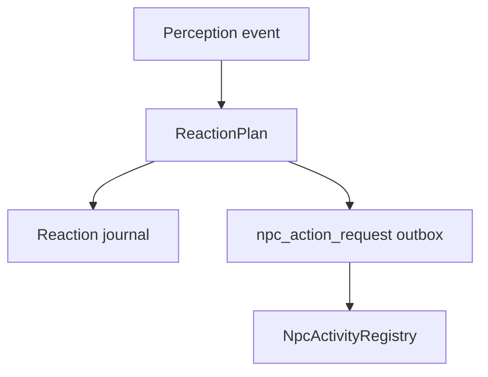

# MMO server perception reaction activity dispatch - step 184

Ten krok sprawia, ze `npc_action_request` z reakcji percepcji nie jest juz tylko wpisem
w outboxie. Po udanym enqueue serwer aktualizuje takze runtime `NpcActivityRegistry`.

## Co zostalo dodane

- `NpcActivity::parseKind` rozumie teraz action keys generowane przez perception reaction:
  - `warn`,
  - `interrupt`,
  - `suspect_crime`,
  - `call_help`,
  - `queue_script`,
  - `start_combat`.
- `warn`, `interrupt`, `suspect_crime`, `call_help` i `queue_script` mapuja sie na `Alert`.
- `start_combat` mapuje sie na `Combat`.
- Po `mmo_server_action_outbox` enqueue serwer wywoluje `gNpcActivityRegistry.applyActivity`.
- Jesli nowa aktywnosc preemptuje rozmowe, serwer wywoluje `cancelInterruptedConversation`.
- Konflikt aktywnosci nie kasuje outboxa; jest logowany jako
  `[perception_reaction_activity_rejected]`.

## Przeplyw po tym kroku

## Dlaczego to jest wazne

Outbox daje trwalosc i idempotencje, ale sam z siebie nie zmienia stanu runtime NPC.
`NpcActivityRegistry` daje serwerowi natychmiastowa wiedze, ze NPC jest teraz np. w stanie
`alert` albo `combat`. To jest potrzebne, zeby kolejne systemy serwera mogly podejmowac decyzje
na podstawie aktywnego stanu NPC, a nie tylko historii DB.

## Granice tego kroku

- To nadal nie jest pelny worker `mmo_claim_next_server_action`.
- Nie ma jeszcze zapisu worker result dla `npc_action_request`.
- Dispatcher nie wykonuje jeszcze pathfindingu, dialogu ani walki.
- DB bridge nadal jest przejsciowy i przy przyszlym przepisaniu bazy outbox/registry powinny
  zostac rozdzielone na trwaly command stream oraz runtime world state.

## Nastepny krok

Kolejny praktyczny wycinek to DB worker dla `npc_action_request`:

1. claimuje pending action z `mmo_claim_next_server_action`,
2. parsuje payload `mmo.npc_action_request.v1`,
3. odpala ten sam mapping do `NpcActivityRegistry`,
4. zapisuje `mmo_record_server_action_worker_result`,
5. oznacza akcje jako applied albo failed.
